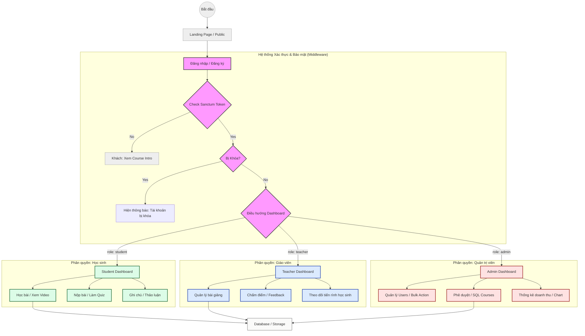

# 🔐 BeeLearn: RBAC & Workflow Permissions

Tài liệu này chi tiết hóa cách thức hệ thống BeeLearn quản lý quyền hạn của người dùng (Role-Based Access Control) và luồng xử lý yêu cầu (Request Workflow).

---

## 🏗️ Workflow Kiểm Tra Quyền Hạn

Mọi yêu cầu (request) tới các endpoint được bảo vệ trên Backend sẽ đi qua một chuỗi các Middleware để đảm bảo tính an toàn và quyền hạn chính xác.



---

## 👥 Chi tiết các Vai trò (Roles)

### 1. Học sinh (`student`)
- **Mục tiêu**: Người tiếp nhận nội dung giáo dục.
- **Quyền hạn chính**:
    - Đăng ký khóa học (Enrollment).
    - Xem nội dung bài học (Video, Document).
    - Làm bài tập (Assignment) và Bài kiểm tra (Quiz).
    - Quản lý ghi chú cá nhân (Notes) và thảo luận trong khóa học.

### 2. Giáo viên (`teacher`)
- **Mục tiêu**: Người tạo nội dung và quản lý chất lượng học tập.
- **Quyền hạn chính**:
    - Quản lý nội dung khóa học được phân công.
    - Tạo các loại bài giảng đa phương tiện.
    - Chấm điểm bài nộp của học sinh.
    - Xem báo cáo tiến độ của học sinh trong lớp mình dạy.

### 3. Quản trị viên (`admin`)
- **Mục tiêu**: Người vận hành và quản trị hệ thống toàn diện.
- **Quyền hạn chính**:
    - Quản lý toàn bộ người dùng (Thêm, Xóa, Khóa tài khoản).
    - Phân quyền vai trò (Admin/Teacher/Student).
    - Xem các báo cáo kinh doanh, doanh thu và thống kê tăng trưởng.
    - Quản lý danh mục và thông tin khóa học ở mức độ cao nhất.

---

## 🛡️ Implementation Details (Backend)

Hệ thống sử dụng **Sanctum** để xác thực và các Middleware tùy chỉnh để phân quyền:

- `auth:sanctum`: Xác thực người dùng qua Bearer Token.
- `role:admin,teacher`: Middleware `CheckRole` kiểm tra trường `role` trong database.
- `not_banned`: Middleware `CheckIfNotBanned` kiểm tra cột `banned_until` của người dùng.

Ví dụ định nghĩa Route trong `api.php`:
```php
Route::middleware(['auth:sanctum', 'role:admin'])->group(function () {
    Route::get('/admin/stats', [AdminController::class, 'stats']);
});
```
