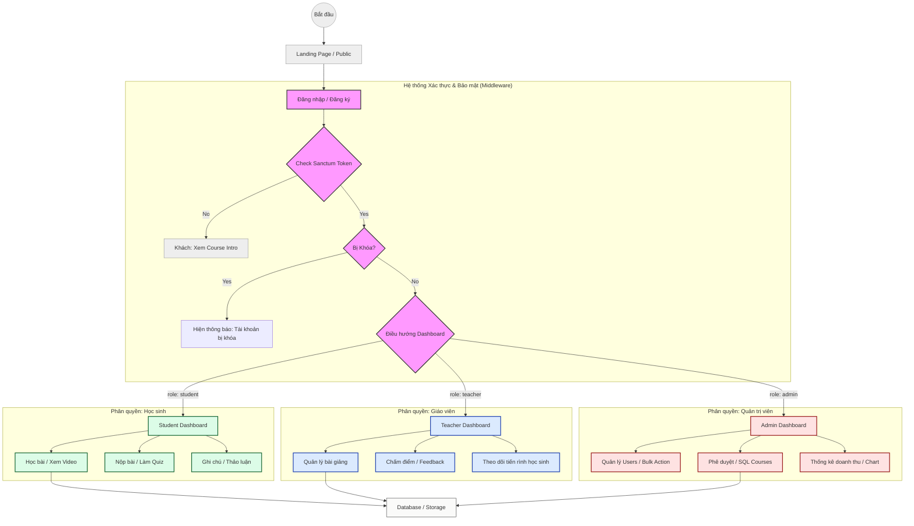

# Sơ đồ Workflow Phân quyền (RBAC)

Dự án sử dụng cơ chế Role-Based Access Control (RBAC) để quản lý quyền hạn của người dùng. Mỗi vai trò (Admin, Teacher, Student) sẽ có các quyền truy cập khác nhau vào các tài nguyên của hệ thống.

## User Review Required

> [!IMPORTANT]
> Sơ đồ sẽ được thêm trực tiếp vào `README.md` dưới mục **Architecture & Structure** hoặc một mục mới có tên **Workflow & Permissions**. Bạn có muốn đặt nó ở vị trí cụ thể nào khác không?

## Proposed Changes

### Documentation

#### [MODIFY] [README.md](file:///c:/eng_project/README.md)
- Thêm một section mới "🔐 Workflow & Permissions" chứa sơ đồ Mermaid.
- Sơ đồ sẽ mô tả luồng kiểm tra:
    1. **Authentication**: Kiểm tra token (Sanctum).
    2. **Banned Check**: Kiểm tra xem user có bị ban hay không (`CheckIfNotBanned`).
    3. **Role Check**: Kiểm tra role (`CheckRole`) - Admin, Teacher, Student.
    4. **Resource Access**: Quyền truy cập cụ thể (CRUD khóa học, bài học, chấm điểm, v.v.).

## Mermaid Diagram Preview (Enhanced)

## Verification Plan

### Manual Verification
- Xem trước file `README.md` trong trình chỉnh sửa để đảm bảo sơ đồ hiển thị đúng.
- Kiểm tra nội dung sơ đồ có khớp với logic trong `backend/routes/api.php` hay không.
